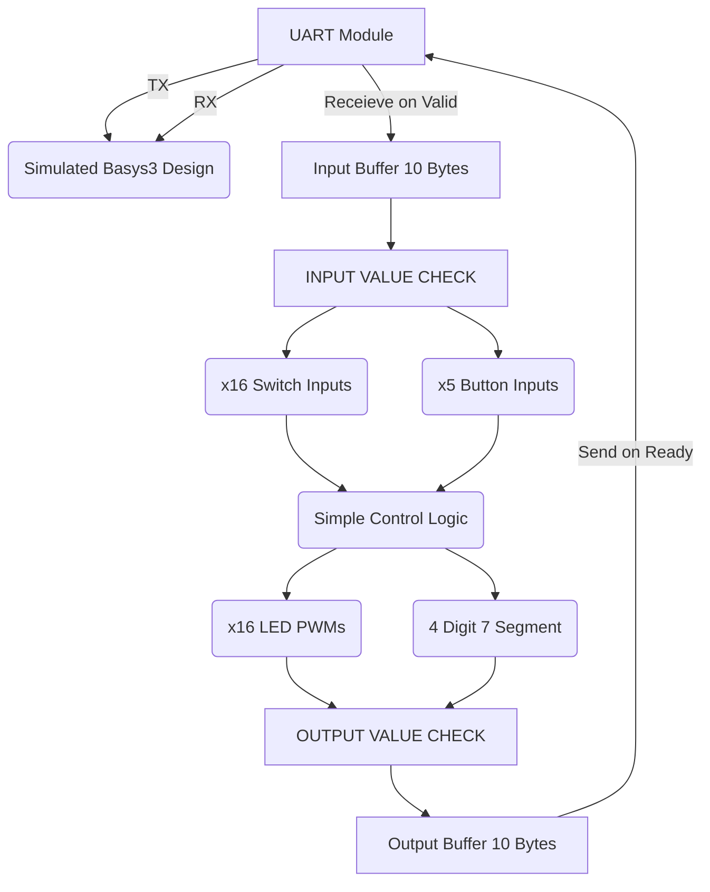

   

# Tiny Tapeout Basys 3 UART Design

```mermaid
flowchart
    
    uart["UART Module"] -->|TX| pmod("Simulated Basys3 Design")
    uart -->|RX| pmod
    buffer_out["Output Buffer 10 Bytes"] -->|"Send on Ready"| uart
    uart --> |"Receieve on Valid"|buffer_in["Input Buffer 10 Bytes"]
    buffer_in --> read_val["INPUT VALUE CHECK"]
    write_val["OUTPUT VALUE CHECK"] --> buffer_out
    pwm("x16 LED PWMs") --> write_val
    7seg("4 Digit 7 Segment") --> write_val
    read_val --> switches("x16 Switch Inputs")
    read_val --> buttons("x5 Button Inputs")
    control_logic("Simple Control Logic")
    control_logic --> pwm
    control_logic --> 7seg
    switches --> control_logic
    buttons --> control_logic
```