   

# Styler

## How it works

The styler chip is used to transform a 16x16 character glyph bitmap based on a
set of text mode attributes. It consists of a 4-bit scanline register, an 8-bit
control register, a 16-bit bitmap register, and a 25-bit attribute register.
Additionally, three independent input lines are used to control polarity of
faint text (even or odd pixels), text and cursor blink rate, and cursor position.

<table>
  <tr>
    <td align="center"> Normal</td>
    <td align="center"> X-Mirror</td>
    <td align="center">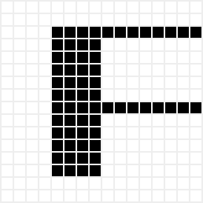 X-Scale</td>
    <td align="center">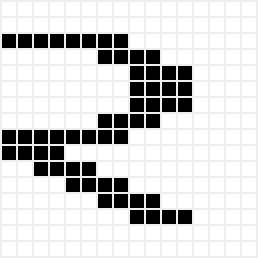 X-Offset</td>
    <td align="center">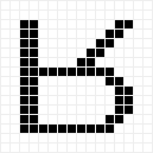 Y-Mirror</td>
  </tr>
  <tr>
    <td align="center">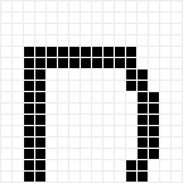 Y-Scale</td>
    <td align="center">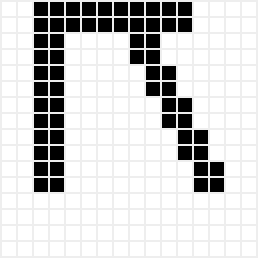 Y-Offset</td>
    <td align="center">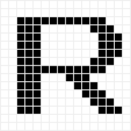 Bold</td>
    <td align="center">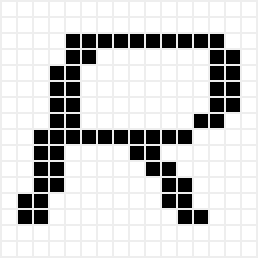 Italic</td>
    <td align="center"> Reverse Italic</td>
  </tr>
  <tr>
    <td align="center">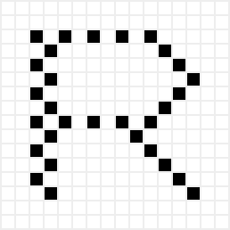 Faint</td>
    <td align="center">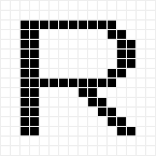 Blink</td>
    <td align="center"> Alternate</td>
    <td align="center">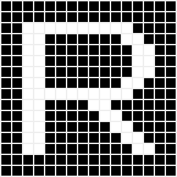 Inverse</td>
    <td align="center">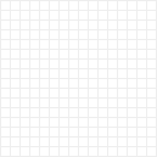 Hidden</td>
  </tr>
  <tr>
    <td align="center">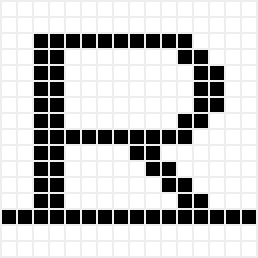 Underline</td>
    <td align="center">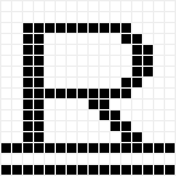 Double Underline</td>
    <td align="center"> Dotted Underline</td>
    <td align="center">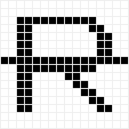 Strikethru</td>
    <td align="center">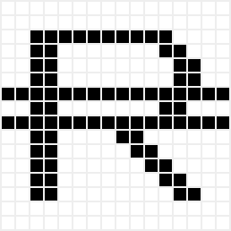 Double Strikethru</td>
  </tr>
  <tr>
    <td align="center">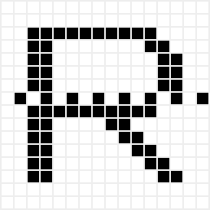 Dotted Strikethru</td>
    <td align="center">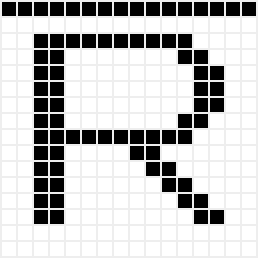 Overline</td>
    <td align="center">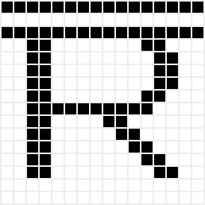 Double Overline</td>
    <td align="center">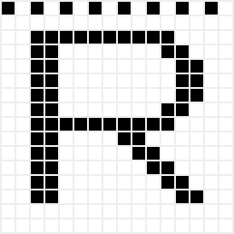 Dotted Overline</td>
    <td align="center">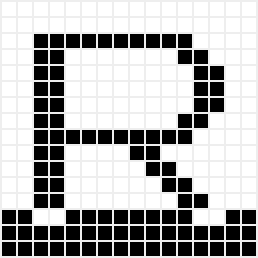 Cursor</td>
  </tr>
</table>

Typical use of the styler chip follows these steps:

1. Set output enable (input 6) HIGH and write enable (input 7) LOW.
2. Set the address (inputs 0-2) to 0.
3. Set the bidirectional pins to the physical scanline number.
4. Pulse `clk`.
5. Set output enable (input 6) LOW and write enable (input 7) HIGH.
6. Read the logical scanline number from the bidirectional pins.
7. Set output enable (input 6) HIGH and write enable (input 7) LOW.
8. Set the address (inputs 0-2) to 2.
9. Set the bidirectional pins to the right half of the row of the character bitmap corresponding to the logical scanline number.
10. Pulse `clk`.
11. Set the address (inputs 0-2) to 3.
12. Set the bidirectional pins to the left half of the row of the character bitmap corresponding to the logical scanline number.
13. Pulse `clk`.
14. Set output enable (input 6) LOW and write enable (input 7) HIGH.
15. Set the address (inputs 0-2) to 2.
16. Read the right half of the final character bitmap from the bidirectional pins.
17. Set the address (inputs 0-2) to 3.
18. Read the left half of the final character bitmap from the bidirectional pins.

You can also read from the dedicated output pins without changing output enable or write enable.

The register layout is as follows:

| Address | Bits | Description                                                       |
| ------- | ---- | ----------------------------------------------------------------- |
| 0       | 0-3  | Input: physical scanline number; output: logical scanline number. |
| 0       | 4-7  | Input: ignored; output: 0.                                        |
| 1       | 0    | Show cursor at bottom of character cell.                          |
| 1       | 1    | Show cursor at top of character cell.                             |
| 1       | 2    | Enable cursor blink.                                              |
| 1       | 3    | Enable cursor.                                                    |
| 1       | 4    | Enable character underline, strikethrough, overline attributes.   |
| 1       | 5    | Enable character blink, alternate attributes.                     |
| 1       | 6    | Reserved.                                                         |
| 1       | 7    | Reserved.                                                         |
| 2       | 0-7  | Right half of character glyph bitmap.                             |
| 3       | 0-7  | Left half of character glyph bitmap.                              |
| 4       | 0    | X offset. (Determines which half of a double-width character.)    |
| 4       | 1    | Double width.                                                     |
| 4       | 2    | Y offset. (Determines which half of a double-height character.)   |
| 4       | 3    | Double height.                                                    |
| 4       | 4    | X premirror (flip input bitmap horizontally).                     |
| 4       | 5    | X postmirror (flip output bitmap horizontally).                   |
| 4       | 6    | Y premirror (invert physical scanline).                           |
| 4       | 7    | Y postmirror (invert logical scanline).                           |
| 5       | 0    | Bold.                                                             |
| 5       | 1    | Faint.                                                            |
| 5       | 2    | Italic.                                                           |
| 5       | 3    | Reverse italic.                                                   |
| 5       | 4    | Blink (text only, VT100-style).                                   |
| 5       | 5    | Alternate (text and background, Apple II-style).                  |
| 5       | 6    | Inverse.                                                          |
| 5       | 7    | Hidden.                                                           |
| 6       | 0    | Underline.                                                        |
| 6       | 1    | Double underline.                                                 |
| 6       | 2    | Dotted underline.                                                 |
| 6       | 3    | Strikethrough.                                                    |
| 6       | 4    | Double strikethrough.                                             |
| 6       | 5    | Dotted strikethrough.                                             |
| 6       | 6    | Overline.                                                         |
| 6       | 7    | Double overline.                                                  |
| 7       | 0    | Dotted overline.                                                  |
| 7       | 1-7  | Input: ignored; output: 0.                                        |

The input pin assignments are as follows:

| Pin | Description                               |
| --- | ----------------------------------------- |
| 0   | A0 (address line 0).                      |
| 1   | A1 (address line 1).                      |
| 2   | A2 (address line 2).                      |
| 3   | Faint text polarity (even or odd pixels). |
| 4   | Blink phase.                              |
| 5   | Cursor enable.                            |
| 6   | /OE (output enable).                      |
| 7   | /WE (write enable).                       |

## How to test

The `test.py` file covers a variety of test cases.

## External hardware

The styler chip is intended to be used as part of a larger text mode
video display hardware project.

## What is Tiny Tapeout?

Tiny Tapeout is an educational project that aims to make it easier and cheaper than ever to get your digital and analog designs manufactured on a real chip.

To learn more and get started, visit https://tinytapeout.com.

## Resources

- [FAQ](https://tinytapeout.com/faq/)
- [Digital design lessons](https://tinytapeout.com/digital_design/)
- [Learn how semiconductors work](https://tinytapeout.com/siliwiz/)
- [Join the community](https://tinytapeout.com/discord)
- [Build your design locally](https://www.tinytapeout.com/guides/local-hardening/)

## What next?

- [Submit your design to the next shuttle](https://app.tinytapeout.com/).
- Edit [this README](README.md) and explain your design, how it works, and how to test it.
- Share your project on your social network of choice:
  - LinkedIn [#tinytapeout](https://www.linkedin.com/search/results/content/?keywords=%23tinytapeout) [@TinyTapeout](https://www.linkedin.com/company/100708654/)
  - Mastodon [#tinytapeout](https://chaos.social/tags/tinytapeout) [@matthewvenn](https://chaos.social/@matthewvenn)
  - X (formerly Twitter) [#tinytapeout](https://twitter.com/hashtag/tinytapeout) [@tinytapeout](https://twitter.com/tinytapeout)
