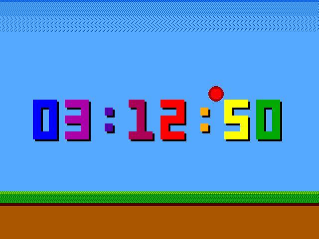

<!---

This file is used to generate your project datasheet. Please fill in the information below and delete any unused
sections.

You can also include images in this folder and reference them in the markdown. Each image must be less than
512 kb in size, and the combined size of all images must be less than 1 MB.
-->

## How it works

Typical Verilog design that generates VGA timing and RGB222 colour outputs compatible with the Tiny VGA PMOD.

It produces a bouncing ball animation over the top of an adaptation of Matt Venn's VGA clock, from here: https://github.com/mattvenn/tt08-vga-clock

## How to test

*   Plug in a VGA monitor via Tiny VGA PMOD.
*   Set `mode` input to 0, i.e. specifying 640x480 60Hz from a 25MHz clock.
*   Set `show_clock` input to 1.
*   Set `pmod_select` input to 0 for Tiny VGA PMOD. Otherwise, 1=Matt's VGA Clock PMOD.
*   Supply a 25MHz clock (clock's actual seconds timer assumes exactly 25.000MHz).
*   Assert reset.
*   Pulse or hold the `adj_*` inputs to adjust hours, minutes, or seconds.

## External hardware

Tiny VGA PMOD and VGA monitor is all you should need externally.

