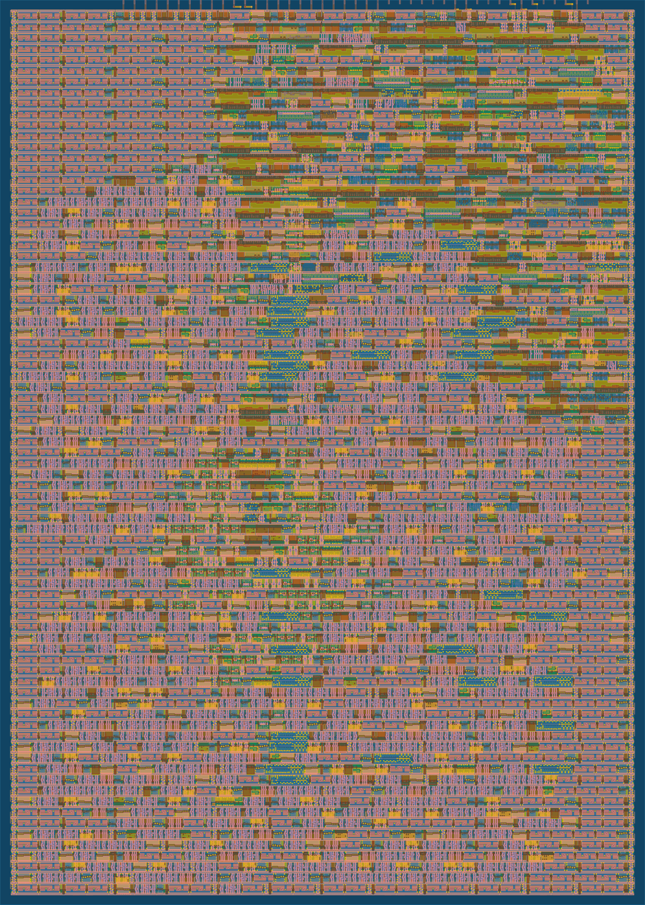

   

# Tiny Tapeout Perceptron-Based Branch Predictor
 \
This project implements a perceptron-based branch predictor on TinyTapeout. Documentation available [here](docs/info.md). \
Some details:
* 1x2 tile (about 160um x 225 um)
* 130nm SkyWater node
* 64B of memory for perceptron weights (8b each)
* History length: 7
* Number of perceptrons: 8
* ~82% accuracy on a small reference program (`func_sim/reference.c`)
* Implements automatic memory reset guarantee a clean state

## What is Tiny Tapeout?
Tiny Tapeout is an educational project that aims to make it easier and cheaper than ever to get your digital and analog designs manufactured on a real chip.

To learn more and get started, visit https://tinytapeout.com.
