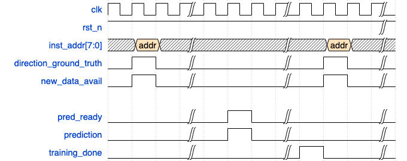
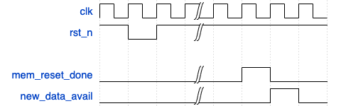

<!---

This file is used to generate your project datasheet. Please fill in the information below and delete any unused
sections.

You can also include images in this folder and reference them in the markdown. Each image must be less than
512 kb in size, and the combined size of all images must be less than 1 MB.
-->

## How it works
This project implements a very minimal perceptron-based branch predictor. Using basic SPI, it reads in the lower part of the address of a branch instruction and its ground truth branch direction (taken or not taken).
Due to constraints on the memory architecture (namely, 1 byte read per cycle), the prediciton is not single-cycle.

The branch predictor is based on this paper: [Dynamic Branch Prediction with Perceptrons](https://www.cs.utexas.edu/~lin/papers/hpca01.pdf).

This project uses latch-based memory from Michael Dell, available at: [tt06-memory](https://github.com/MichaelBell/tt06-memory)

It's best to run this project in its Docker container.

The `func_sim` directory contains a C++ functional simulation of the infrastructure. It parses a log file of a simulated execution of a RISC-V reference program and predicts the branch direction on each branch instruction.
From the `func_sim` directory:
-Compile the reference: `riscv32-unknown-elf-gcc -O0 start.S reference.c -o reference -march=rv32i_zicsr_zifencei -T link.ld -nostartfiles -nostdlib`
-Disassemble reference: `riscv32-unknown-elf-objdump -d reference > reference_dis.txt` (for info only)
-Run Spike on reference: `spike --log=spike_log.txt --log-commits --isa=rv32i_zicsr_zifencei --priv=m -m128 reference` (to generate execution log)
-Make Makefile: `cmake CMakeLists.txt`
-Compile functional simulation: `make`
-Run: `./build/func_sim ./spike_log.txt`

The `tests` directory includes all CocoTB test for this design.
Run them with `make`.

The documentation waveform is generated by [Wavedrom](https://github.com/wavedrom/wavedrom).

## How to test
The branch predictor reads the lowest 8b of a 32b RISC-V address on pins `inst_addr`, the branch direction on pin uio[1] and a pulse notifying that new data is available on pin `new_data_avail`.
Once the prediction is ready, it pulses pin `pred_ready`, pushes the prediction on pin `prediction`. Once training is complete, it pulses pin `training_done`.
You can also request the history buffer by pulsing pin `history_buffer_request`. On the next cycle, the branch history will be sent to pin `DEBUG_history_buffer_output`, one cycle at a time, starting from the most recent.

Notes:
- After rst_n goes back high, you must wait for `mem_reset_done` to pulse. This is because the branch predictor resets its own memory. If new data comes in while it is resetting its memory, an inference will not be started.
- If no training is required this round, `training_done` pulses at the same time as `pred_ready`.
- If new data is sent while the predictor is training, it will be ignored and a new inference will not be started.

Prediction waveform:

Reset waveform:

To generate the instructions to use, you can either:
1) Parse `func_sim/spike_log.txt` with is a log of all instructions ran for the program `func_sim/reference.c` simulated on RISC-V rv32i_zicsr_zifencei. See `func_sim/src/func_sim.cpp` to see how that's done.
2) Generate a new log for a program of your choice. For this, you'll need to build the Docker. Word of caution: The Dockert takes >30 min top build and weighs >24GB.
   1) From root, run: `docker build -t tt_brand_predictor .`
   2) Once complete, run: ``docker run -it -v `pwd`:/tmp tt_brand_predictor``
   3) Move to `func_sim`: `cd func_sim`
   4) Compile `reference.c`: `riscv32-unknown-elf-gcc -O0 start.S reference.c -o reference -march=rv32i_zicsr_zifencei -T link.ld -nostartfiles -nostdlib`
   5) Optionally, view the disassembly with: `riscv32-unknown-elf-objdump -d reference > reference_dis.txt`
   6) Generate execution log with Spike: `spike --log=spike_log.txt --log-commits --isa=rv32i_zicsr_zifencei --priv=m -m128 reference`
3) Running `func_sim` outputs a list of all branch instruction and the state of important registers in the branch predictor. You can use that to check if the predicted branch outcome is correct: `./build/func_sim ./spike_log.txt`

## External hardware
- Some way to drive 10b (Arduino, FPGA, etc.)
- Some way to read 5b (Arduino, FPGA, oscilloscope, etc.)