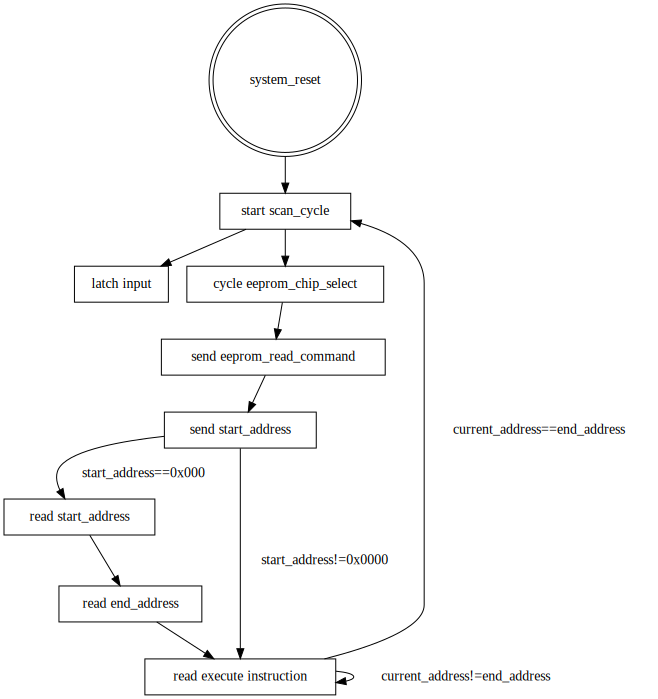

## How it works

The VSLC (Very Small Logic Controller) is a stack machine with 8 inputs
and 8 outputs and two timers. It takes inspiration from relay logic,
early PLCs and their processors, such as the Motorola
[MC14500B](https://en.wikipedia.org/wiki/Motorola_MC14500B) (known to me
through the [UE-1/UEVTC/UE1450](https://github.com/Nakazoto/UEVTC)). While
not the first time I heard of relay logic, one of the more in depth views of it
I've had was from [Technology Connections](https://www.youtube.com/@TechnologyConnections) video series on
the [logic inside an William's 1976 Aztec pinball machine](https://www.youtube.com/playlist?list=PLv0jwu7G_DFVAUoqtVxFVIu2oZc2GGyDf)

Another not-my-first-introduction, but Ben Eater's series on building a
[6502-based computer](https://eater.net/6502) and an
[8-bit TTL computer](https://eater.net/8bit) reïnvigorated my interest in
electronics and the low-level aspects of computer hardware.

My design goal was to have a small processor that could be programmed to
handle small control tasks. Specifically, I wanted something that could
run crossing gates on my model train layout. This requires sensing
rising and falling edges of sensors, flashing lights, and actuating a
servo.

Given the relay and PLC "heritage", I reference "scan cycles",
"setting", and "resetting" registers. The scan cycle is one trip through
the program and sees the input as it was at the start of the cycle.
"Setting" a register turns it "on"/sets it to 1. "Resetting" is turning
it off/setting it to 0. I try to refer to cycling the reset line of the
module, i.e. `rst_n` as a "system reset" to avoid confusion. I am not a
professional in industrial automation, just a hobbyist, if I'm using any
terms wrong or confusingly please let me know.

Once powered on, the controller needs to be held in a system reset for
at least a cycle.

On system reset, the start address is set to 0x0000.  The controller
will send a READ command (0x03), a 16-bit 0 address, and expects to
receive a 2 byte scan cycle vector (i.e. the first instruction for
subsequent runs), a 2 byte scan cycle end address (i.e. the last valid
instruction), followed by instructions.  Once the end address is reached
a new scan cycle is initiated. A scan cycle begins by latching input
while cycling the EEPROM chip select for 1 cycle, followed by a READ
command (0x03) and the 16-bit cycle start vector.

During a cycle, the value of an input will be unchanging even if the actual
input to the pin changes during the execution of the cycle. `RISING` and
`FALLING` are defined as changes between cycle starts. If a full cycle
happens during cycle execution, it will not be seen by the program.




------


## How to test

Place a program on EEPROM (or an emulator), and use the IO pins.

Example 0 is a short and a good place to start.

The file [examples/prog0.vslc](examples/prog0.vslc) is:

````
PUSH i0
DUP
POP o0
NOT
PUSH o1
````

This program begins by taking the value of input 0 at the last positive
edge of the scan cycle clock and placing it on the stack.

````
top of stack: [i0](i0)
````

It then duplicates that value.

````
top of stack: [i0](i0) [i0](i0)
````

followd by popping one instance from the top of the stack and placing it
in the output 0 register.

````
top of stack: [i0](i0)
````

The top of the stack is then inverted.

````
top of stack: /[i0](i0)
````

Finally, that value is popped to output register 1.

If `o0` and `01` were attached to active-high LEDs and `i0` attached to an
active high momentary button, one LED would be on when the button isn't
pressed. Once the button is pressed, that LED turns off and the other turns
on. When the button is let go, the lights toggle.

To assemble the source code, we can run `./vslcc examples/prog0.vslc` and
get the output:

````
line_num=1 line='PUSH i0'
  cur_addr=00 => PUSH I0 => 00(00000000)
line_num=2 line='DUP'
  cur_addr=01 => DUP => b5(10110101)
line_num=3 line='POP o0'
  cur_addr=02 => POP O0 => 18(00011000)
line_num=4 line='NOT'
  cur_addr=03 => NOT => 8a(10001010)
line_num=5 line='PUSH o1'
  cur_addr=04 => PUSH O1 => 09(00001001)
cur_addr=9
start_addr=b'\x00\x04' end_addr=b'\x00\x08'
````

The compiler/assembler generates `examples/prog0.eeprom.bin`. Checking that
it exists with `ls -l examples/prog0.eeprom.bin`

````
-rw-rw-r-- 1 jim jim 1024 Feb 13 20:28 examples/prog0.eeprom.bin
````

shows us that the file is 1kB (8kb) in size! The compiler generates a file
adequate for a 8kb EEPROM, and pads the rest of the file with `0xff`.

We can then look at the generated
output with `xxd examples/prog0.eeprom.bin| head -n 2`

````
00000000: 0004 0008 00b5 188a 09ff ffff ffff ffff  ................
00000010: ffff ffff ffff ffff ffff ffff ffff ffff  ................
````

we see the padded `0xff`s. The actual program also seems to be 4 bytes
longer than we would expect, as our program is 5 instructions long. The
first 16-bits are the start address for a new cycle. The second 16-bits
are the last valid program address, after which a new cycle should be
started.

There is also a disassembler. We can try
`./vslcd examples/prog0.eeprom.bin` and get

````
; starting address is the default
; .start 4
PUSH i0
DUP
POP o1
NOT
PUSH o2
; ending address is the default
; .end 8
````

Nothing too exciting.

Once we start the controller, it will cycle the EEPROM chip select,
start a scan cycle which will latch the input,
send a read command (0x03) for address 0x0000, read the starting address of
0x0004, then the end address of 0x0008 then the end address of 0x0008.
It will then begin executing the next byte it receives. It will continue
to send the SPI clock and expect bytes in return. Once it has executed
the instruction at the ending address, the EEPROM chip select is cycled
and a new scan cycle is started which latches the input. The controller
will then send the read command (0x03) for address 0x0004 and begin
execution at the first byte it receives. This will continue until the
controller is powered down.

------


## External hardware

The controller expects something that presents as an EEPROM that accepts
16-bit addresses and will provide continous data while the clock and chip
select are active.

------


## General Architecture

* Stack machine
* Code executes until the end of code memory is reached, in which case a
  new cycle is started
* 8 input bits/registers mapped to pins
* 8 output bits/registers mapped to pins
* 16 bit data stack
* 1 timer/counter with clock divisor
* 1 timer/counter for driving a servo

### Opcodes

#### General Decoding rules

* Bit 7
* 0: Register Operations
* Bit 6
  * 00: IO Registers
  * 01: Special Function Registers (SFR)
* Bit 5,4
  \* 00 Push
  \* 01 Pop
  \* 10 Set
  \* 11 Reset
* 1: Operations
* Bit 6
* 0: Logical Operations
  These all write to the top of stack. The shifts below are the final
  shifts, not the number of pops before the operation pushes. e.g. `NOT`
  conseptually does a pop and then a push, which is a shift of 0.
  \* Bit 5,4
  * 00: No Shift
  * 01: Shift 1 Right
  * 10: Reserved
  * 11: Shift 1 Left
    \* Bits 3,2,1,0: Truth table. The result is bit `3 - {nos, tos}`
* 1: Other
  \* Bit 5
  * 0: Temporal (Rising/Falling)
  * Bit 4 - Expected previous state
  * 1: Other
  * Bit 4:
  * 0: Set Parameters
  * 1: Other

#### Register Operations

````
PUSH reg    0000 IRRR
POP  reg    0001 1RRR
SET  reg    0010 1RRR
RESET reg   0011 1RRR
PUSH sfr    0100 RRRR
POP sfr     0101 RRRR
SET sfr     0110 RRRR
RESET sfr   0111 RRRR
````

#### Logical Operations

````
AND         1010 0001
NAND        1010 1110
OR          1010 0111
NOR         1010 1000
XOR         1010 0110
BICOND      1010 1001
IMPL        1010 1101
NIMPL       1010 0010
CONV        1010 1011
NCONV       1010 0100

DUP         1000 1100
OVER        1000 1010
DROP        1010 1010
ZERO        1011 0000
ONE         1011 1111
NOT         1001 0011
OVERNOT     1010 0101
````

#### Temporal Operations

````
RISING  reg 1100 IRRR
FALLING reg 1101 IRRR
````

#### Parameters

These are followed by a byte with the value to set

````
SPARAM0 parm 1110 0PPP XXXX XXXX
SPARAM1 parm 1110 1PPP XXXX XXXX
````

#### Other

````
CLR         1111 0000
SETALL      1111 0001
SWAP        1111 0010
ROT         1111 0011
NOP         1111 1111
````

### Special Function Registers SFR

* 0x0 Timer Enable
* 0x1 Timer Output
* 0x2 Servo Enable
* 0x3 Servo Value
* 0x4 Servo Output

### Parameter

* 0x0 SPI Clock Divider (Not Implemented)
* 0x1 Timer0 Clock Divider (4 bits)
* 0x2 Timer0 Counter A (Not Implemented)
* 0x3 Timer0 Counter B (Not Implemented)
* 0x4 Servo0 Clock Divider (Not Implemented)
* 0x5 Servo0 Frequency Value (Not Implemented)
* 0x6 Servo0 Reset Value (Not Implemented)
* 0x7 Servo0 Set Value (4 bits)

------


## Timer

Due to space constraints, the timer will only output a 50% duty cycle
signal and has a period of 366 timer-ticks long. The clock divider for
the timer can be adjusted from 0 (input clock) to 16
(input clock / 2<sup>16</sup>). At 12MHz, the default clock divider of 14
cycles the timer at 2Hz.

The timer's output is always avaiable on `uio_out[4]`. The complement is
available on `uio_out[5]`. There is a cycle of dead-time inserted between
transitions.

### SFR

* 0x00 Timer Enable - When set the timer will count
* 0x01 Timer Output - The current output of the timer (even when disabled). This is available to the program.

### Parameters

* 0x1 Timer0 Clock Divider (4 bits)
* 0x2 Timer0 Counter A (Not Implemented)
* 0x3 Timer0 Counter B (Not Implemented)

------


## Servo

The servo timer is designed to produce a 50Hz with a duty-cycle between
5% and 13% or pulse-length of between 1ms and 2.6ms. The servo can be set to
one of two positions based on the value of the servo's value SFR. Due to space
constraints, only the set value (i.e. when the servo's value is 1) can be
changed. The reset value is fixed at 11 (1ms pulse). The set value can be
set to any value up to 31 (2.6ms pulse). The default set value is 23 (1.9ms
pulse).  Servos typically accept between 1ms and 2ms to go from 0° and
180°. Practically, this leaves 12 steps (of 15° each) between the
servo's home position and max rotation.

The servo's output is always available on `uio_out[6]`;

### SFR

* 0x2 Servo Enable - Turns the servo counter on when set.
* 0x3 Servo Value - Place the servo at either its set or reset position.
* 0x4 Servo Output - The output of the timer. (Even when the servo is disabled.) This is available to the program.

### Parameter

* 0x4 Servo0 Clock Divider (Not Implemented)
* 0x5 Servo0 Frequency Value (Not Implemented)
* 0x6 Servo0 Reset Value (Not Implemented)
* 0x7 Servo0 Set Value (4 bits)

------


## Assembler

The compiler will generate a 1kB `.eeprom.bin` containing the code, and
a `.final.vslc` with the post-processed code.

### Comments

Anything after a semicolon, `;` on a line will be ignored.

### .define

````
.define alias original
````

Allows aliasing values and register names.

#### Example

````
.define leftsensor i0
push leftsensor
````

is equivilent to

````
push i0
````

### .logic

Allows writing propositional logic statments that will compile to
assembly. Parentheses, `(` and `)`, logical-and `&`, logical-or `|`, xor
`^`, and logical-not `~` are supported. Other values are assumed to be
register names and may be aliased via a `.define`.

#### Example

See [examples/prog2.vslc](examples/prog2.vslc) and [examples/prog2.final.vslc](examples/prog2.final.vslc) for an example
of implementing a counter and 7-segment decoder.

````
.define segC o2

.define t0 s6
.define t1 s7
.define t2 s8
.define t3 s9

.logic (~t3 & t2) | (t3 & ~t2) | (~t1 & t0) | (~t2 & ~t1) | (~t2 & t0)
 POP segC
````

will compile to

````
PUSH S9
NOT
PUSH S8
AND
PUSH S9
PUSH S8
NOT
AND
PUSH S7
NOT
PUSH S6
AND
PUSH S8
NOT
PUSH S7
NOT
AND
PUSH S8
NOT
PUSH S6
AND
OR
OR
OR
OR
POP o2
````

------


