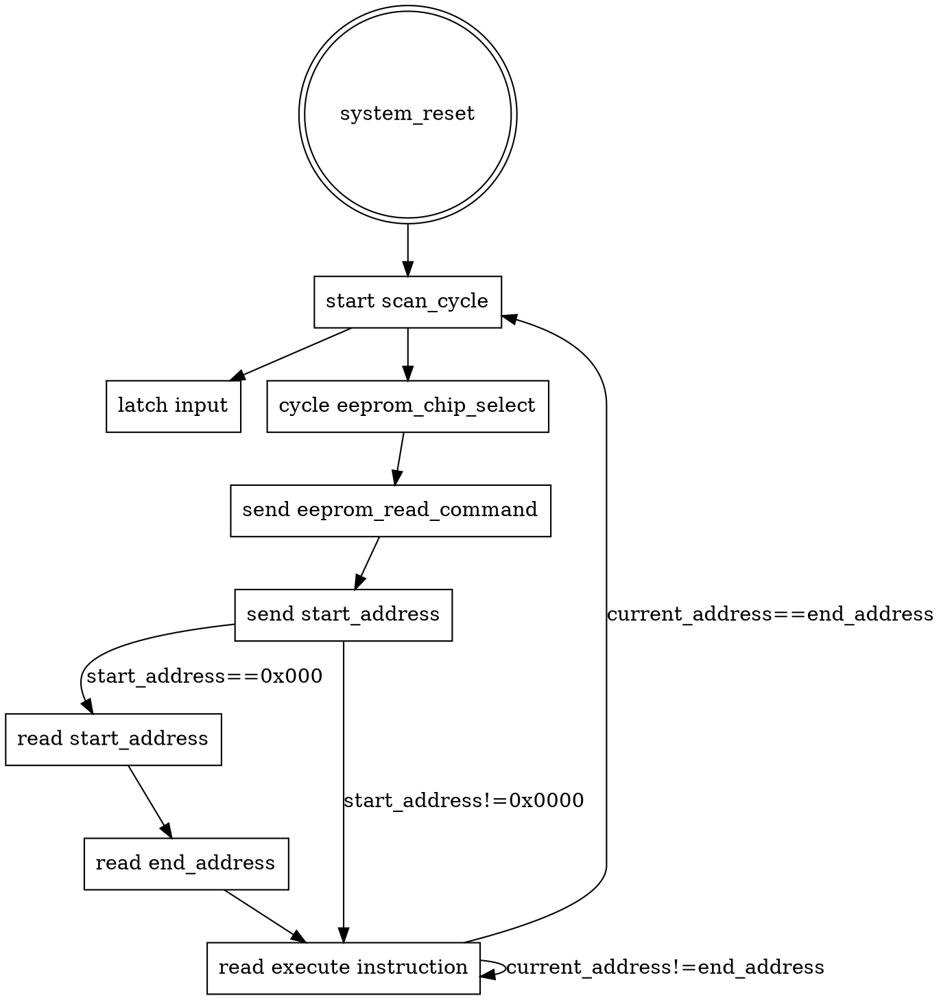

## How it works

The VSLC (Very Small Logic Controller) is a stack machine with 8 inputs
and 8 outputs and two timers. It takes inspiration from relay logic,
early PLCs and their processors, such as the Motorola
[MC14500B](https://en.wikipedia.org/wiki/Motorola_MC14500B) (known to me
through the [UE-1/UEVTC/UE1450](https://github.com/Nakazoto/UEVTC)). While
not the first time I heard of relay logic, one of the more in depth views of it
I've had was from [Technology Connections](https://www.youtube.com/@TechnologyConnections) video series on
the [logic inside an William's 1976 Aztec pinball machine](https://www.youtube.com/playlist?list=PLv0jwu7G_DFVAUoqtVxFVIu2oZc2GGyDf)

Another not-my-first-introduction, but Ben Eater's series on building a
[6502-based computer](https://eater.net/6502) and an
[8-bit TTL computer](https://eater.net/8bit) reïnvigorated my interest in
electronics and the low-level aspects of computer hardware.

My design goal was to have a small processor that could be programmed to
handle small control tasks. Specifically, I wanted something that could
run crossing gates on my model train layout. This requires sensing
rising and falling edges of sensors, flashing lights, and actuating a
servo.

Given the relay and PLC "heritage", I reference "scan cycles",
"setting", and "resetting" registers. The scan cycle is one trip through
the program and sees the input as it was at the start of the cycle.
"Setting" a register turns it "on"/sets it to 1. "Resetting" is turning
it off/setting it to 0. I try to refer to cycling the reset line of the
module, i.e. `rst_n` as a "system reset" to avoid confusion. I am not a
professional in industrial automation, just a hobbyist, if I'm using any
terms wrong or confusingly please let me know.

Once powered on, the controller needs to be held in a system reset for
at least a cycle.

On system reset, the start address is set to 0x0000.  The controller
will send a READ command (0x03), a 16-bit 0 address, and expects to
receive a 2 byte scan cycle vector (i.e. the first instruction for
subsequent runs), a 2 byte scan cycle end address (i.e. the last valid
instruction), followed by instructions.  Once the end address is reached
a new scan cycle is initiated. A scan cycle begins by latching input
while cycling the EEPROM chip select for 1 cycle, followed by a READ
command (0x03) and the 16-bit cycle start vector.

During a cycle, the value of an input will be unchanging even if the actual
input to the pin changes during the execution of the cycle. `RISING` and
`FALLING` are defined as changes between cycle starts. If a full cycle
happens during cycle execution, it will not be seen by the program.

