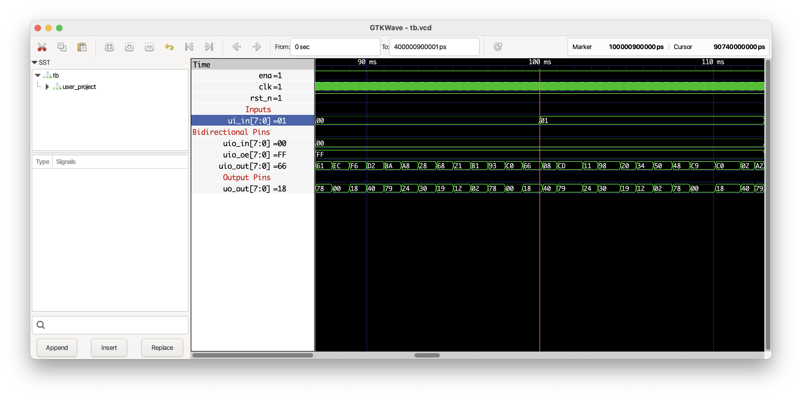

<!---

This file is used to generate your project datasheet. Please fill in the information below and delete any unused
sections.

You can also include images in this folder and reference them in the markdown. Each image must be less than
512 kb in size, and the combined size of all images must be less than 1 MB.
-->

## How it works

This design uses a set of registers to divide the clock and combinational logic to convert binary values into decimal for display.

- Inputs[0]: Selects between a fixed period or a pseudo-random period for counting up the seven-segment display.
- Inputs[1]: Chooses between displaying either a hexadecimal sequence (“0” to “F”) or the text ”-OPENSUSI-AISol-” on the display.
- Bidirectional Outputs: The bottom 8 bits of a 24-bit counter are placed on the bidirectional outputs.

Fixed Period Mode:
- The internal 16-bit compare register is set to 10,000.
- This results in the display incrementing by one each second in case the CLK input is 10KHz.

Pseudo-Random Period Mode:
- If Input[0] is set to 1, an 8-bit pseudo-random value is used as bits 6 to 12 of the 16-bit compare register, introducing variation in the counting period.

## How to test

After reset, the counter will increment by one every second, assuming a 10MHz input clock.

You can experiment by modifying Inputs[1:0] to:
- Change the display characters
- Adjust the pseudo-random sequence of periodic speed

## External hardware

Only TT-EVB.

## Note

This is the first test project designed by “jun1okamura”, supported by OpenSUSI (non-profit) and AIST Solutions inc. in Japan.

