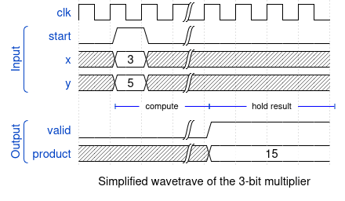
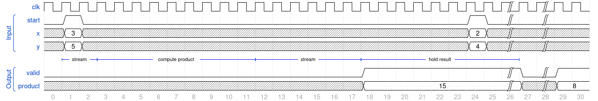

   
# The SSMCl project

This project contains a simple 3-bit unsigned multiplier that has been developed using [Clash](http://www.clash-lang.org) and will be submitted to [TinyTapeout](https://tinytapeout.com/) shuttle number 10.

The design aims to be area/resource efficient at the expense of using multiple clock cycles to compute the product. For fun, the design has been developed using the Clash language. As this is a proof-of-concept design (also for learning Clash), little time and/or effort has been put into actually optimizing the design in any way.
 When `start` is asserted, the values at the `x` and `y` inputs are then being streamed into the actual multiplier, taking 3 cycles in total. The multiplier computes the product in 9 cycles and then steams back the 6-bit product in 6 cycles. The result can be seen at the output bit in cycle 18. This is illustrated by the simplified wave trace below.

The result will be held until the next multiplication starts streaming back its result (the streaming aspect is fully hidden from the end user in this design!). The following wave trace shows this in full detail (there might be an off-by-one error there; I tend to make those. The general mode of operation is correctly captured by the trace!).

## How to test

The input to the multiplier can conveniently be controlled using the web interface of the motherboard. Alternatively, you can connect the input/ouptut pmods as shown in the table in the pinout section below.

## Pinout
| Pin # | Input | Output     |
|-------|-------|------------|
| 0     | y[0]  | product[0] |
| 1     | y[1]  | product[1] |
| 2     | y[2]  | product[2] |
| 3     | x[0]  | product[3] |
| 4     | x[1]  | product[4] |
| 5     | x[2]  | product[5] |
| 6     |       |            |
| 7     | start | valid      |

## Verification
The design has been fed with all 64 possible inputs. The testbench is written in [cocotb](https://www.cocotb.org/) and can be found [here](test/test.py). For valid inputs, the multiplier works correctly and the product/valid bits are always set correctly. 

What has not been tested is what happens when there are assertions of the `start` signal while a multiplication is still being carried out. Depending on your level of pedantry, you can consider this a flaw or not.