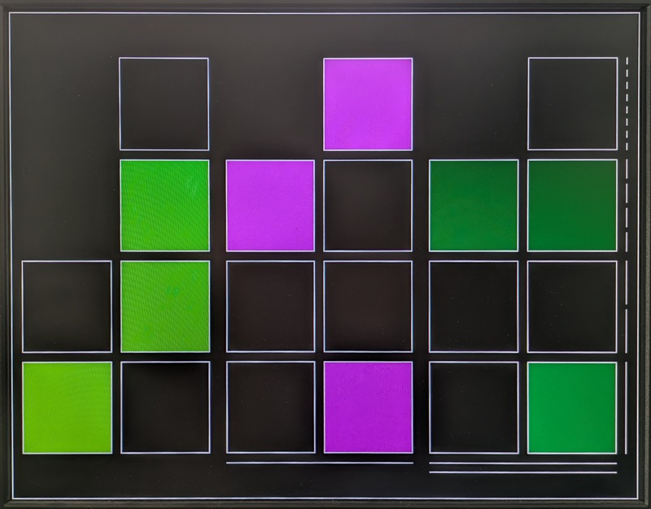

<!---

This file is used to generate your project datasheet. Please fill in the information below and delete any unused
sections.

You can also include images in this folder and reference them in the markdown. Each image must be less than
512 kb in size, and the combined size of all images must be less than 1 MB.
-->

## How it works

The **TT10 Luke Clock** project implements a **VGA-based binary clock** using Chisel. The clock displays hours, minutes, and seconds in a binary format using a matrix of squares, which updates every second. Each colums shows the binary value of a digit of the time in the format HH:MM:SS.

### Facts
- The clock supports multiple time-clock sources (internal and expternal) selectable via input settings and allows user interaction through input buttons (see description in the user input below). 
- The display colors change randomly every day (randomized with LFSR) or with input by the used. The display layout can also be changed by the user. 
- The VGA output generates a 640x480 image at 60 fps.
- All user inputs (buttons and switches) are debounced interanlly.

### Module inputs (ui_in)
- `ui_in(0)`: **Select time clock source [bit 0]**
- `ui_in(1)`: **Select time clock source [bit 1]**
    - `00`: Use internal clock (if set at 25.175 MHz)
    - `01`: Use internal clock (if set at 25 MHz)
    - `10`: Use external 32.768 kHz clock from `ui_in(2)`
    - `11`: Use external 1 Hz clock from `ui_in(3)`
- `ui_in(2)`: **Time clock 1Hz**
    - External 1 Hz time clock input
- `ui_in(3)`: **Time clock 32768Hz**
    - External 32.768 kHz time clock input
- `ui_in(4)`: **Plus** 
    – Used to set the clock or change layout (deoending on select mode inputs)
- `ui_in(5)`: **Minus (button)**
    – Used to set the clock or change layout (deoending on select mode inputs)
- `ui_in(6)`: **Select mode [bit 0]**
- `ui_in(7)`: **Select mode [bit 1]**
    - `00`: Adjust seconds (Plus: clear seconds, Minus: clear seconds)
    - `01`: Adjust minutes (Plus: increase minutes, Minus: decrease minutes)
    - `10`: Adjust hours plus: (Plus: increase hours, Minus: decrease hours)
    - `11`: Switch layout/color (Plus: changes layout, Minus: changes colors)

### Module outputs (uo_out)
The outputs are uused to connect the VGA monitor. They are compatible with with the **TT VGA PMOD** interface.
- `uo_out(0)`: **Red [bit 1]**
- `uo_out(1)`: **Green [bit 1]**
- `uo_out(2)`: **Blue [bit 1]**
- `uo_out(3)`: **Vertical sync**
- `uo_out(4)`: **Red [bit 0]**
- `uo_out(5)`: **Green [bit 0]**
- `uo_out(6)`: **Blue [bit 0]**
- `uo_out(7)`: **Horizontal sync**

###  Module bidirectionals (uio)
The following bidirectionals (all used as output) provide debugging information for internal signals.
- `uio_out(0)`: **(Debug output) tClk**
- `uio_out(1)`: **(Debug output) cntReg [bit 0]**
- `uio_out(2)`: **(Debug output) cntReg [bit 1]**
- `uio_out(3)`: **(Debug output) cntReg [bit 2]**
- `uio_out(4)`: **(Debug output) cntReg [bit 3]**
- `uio_out(5)`: **(Debug output) inDisplayArea**
- `uio_out(6)`: **(Debug output) modeReg [bit 0]**
- `uio_out(7)`: **(Debug output) modeReg [bit 1]**

## How to test
1. **Connect VGA**: Connect the **TT VGA PMOD** to the board and to the VGA monitor.
2. **Connect buttons and switches**: Ensure all input buttons are wired correctly to control clock settings and layout changes.
3. **Select time source**: Use the input settings to choose between the internal clock, an external 32.768 kHz clock, or an external 1 Hz clock.
4. **Set time and layout**: Use the **Plus** and **Minus** buttons and the **Select mode** switches to adjust hours, minutes, and seconds, or switch between different display layouts and colors.
5. **Observe VGA output**: The binary clock should now display the current time, with automatic updates and color changes occurring daily.
6. **Test debugging outputs**: If required, observe **uio_out** signals to verify internal timing and display area status.
7. **Enjoy the clock**: Watch the binary time representation update in real-time on the VGA display.

## External hardware
- TT VGA PMOD modules
- Buttons and switches
- *(Optional)* Real-Time Clock (RTC)
  - For precision timekeeping, an RTC generating 1 Hz or 32.768 kHz can be connected as an external time-clock input.

