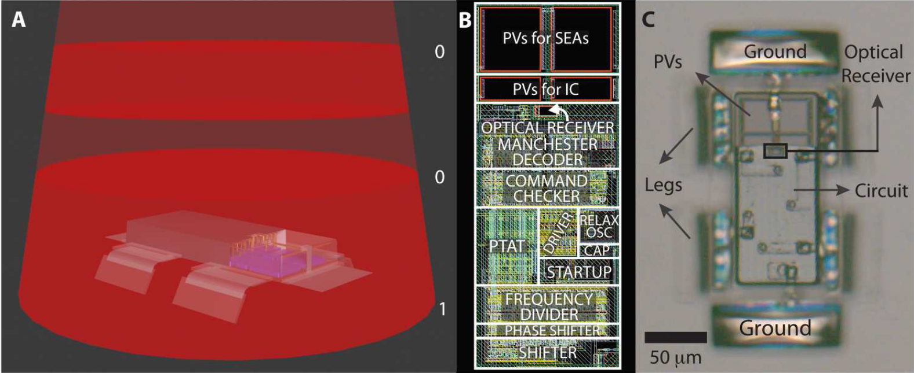
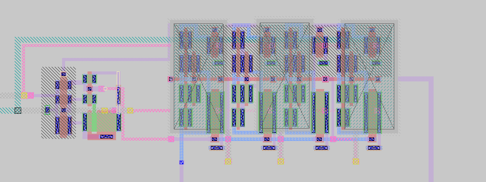
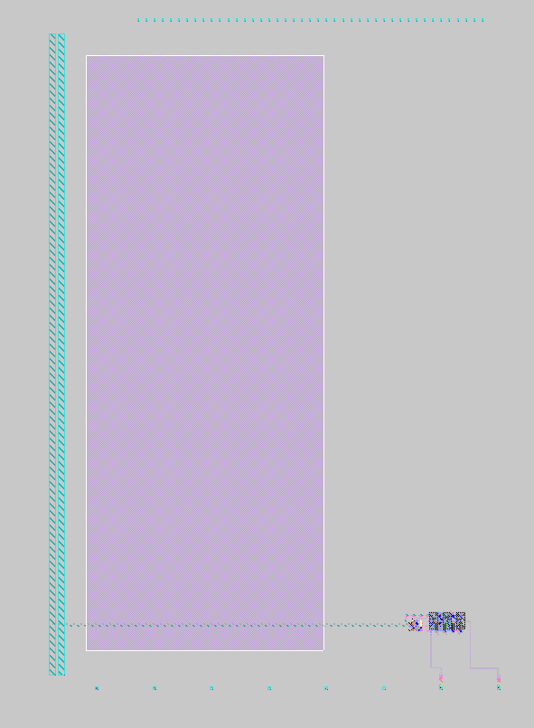
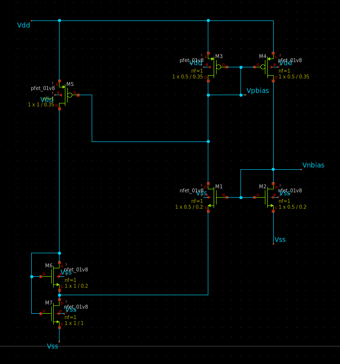
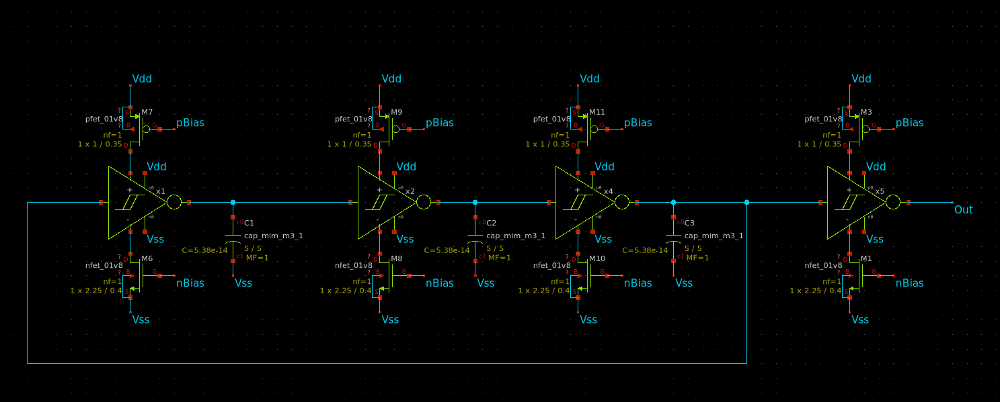
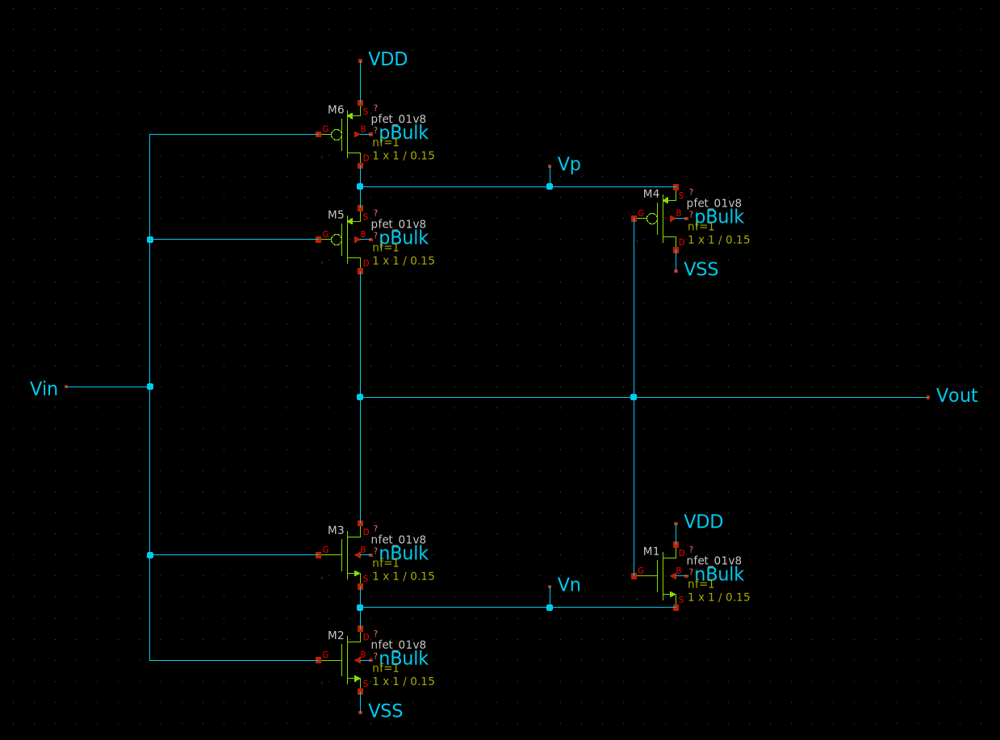
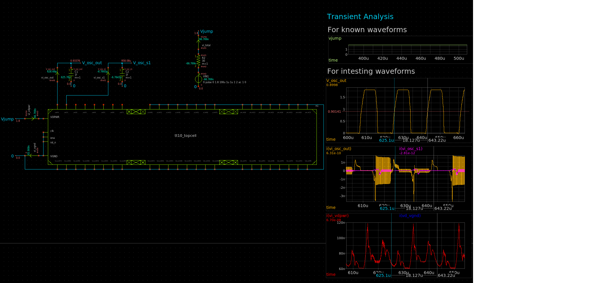
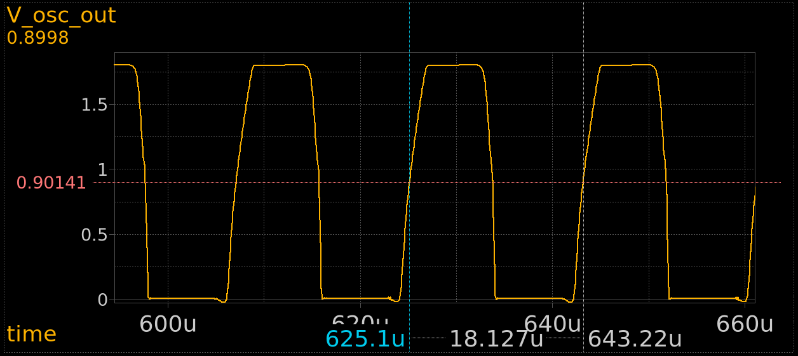

#  TT10 - Microrobot Circuits Documentation [↩](../README.md)

This Tapeout explores some basic low-power, low-cost circuits inspired by Michael F. Reynolds et. al. work Microscopic robots with onboard digital control (2022) [[1]](#1). 
<br>

The image below shows one of the papers robots. This "Dogbot" is able to harvest-energy, receive commands and move on it's own without the need of external actuation.


<br>

## Table of contents
### 1. [↪](#1-background-of-this-tapeout-) Background of this Tapeout
### 2. [↪](#2-disclaimer-) Disclaimer
### 3. [↪](#3-requirements-) Requirements
### 4. [↪](#4-design-choices) Design Choices
### 5. [↪](#5-results-) Results


# 1. Background of this Tapeout [↩](#tt10---microrobot-circuits-documentation-)
This tapeout is part of [Piezobot-V1](https://github.com/jonoboderbonobo/piezobot-v1/blob/main/README.md) which supports the [Open Source Mobile Microrobotics Framework SuRF 🏄‍♀️](https://github.com/jonoboderbonobo/surf/), providing silicon-proven, open source circuit blocks for on-board actuation. These low-power, low-cost designs help researchers and engineers test a wide range of actuation, communication, and energy-harvesting methods in real-life conditions. 
<br> 

With SuRF 🏄‍♀️, the goal is to bring microrobotics closer to practical applications.


# 2. Disclaimer [↩](#tt10---microrobot-circuits-documentation-)
This is the first time for me, a student, designing any integrated circuit. I therefore do not recommend engaging in any of the proposed circuits before I confirmed their behavior by physically testing them. This tapeout only lays the groundwork for future iterations. 

# 3. Requirements [↩](#tt10---microrobot-circuits-documentation-)
To understand the requirements on the circuits we first have to understand the circuits mission profile. The mission profile is heavily influenced by "Dogbot" as well as arbitrary design choices by myself rather than a real world application.
## Dogbot: similarities and differences
For this tapeout, a design similar to Michael F. Reynolds et al. Dogbot [[1]](#1) was selected.

### Limitations of Dogot:
- circuit built with NDA protected PDK
    - [XT018](https://www.xfab.com/xt018) from X-FAB Silicon Foundries
- low speed
    - $ v_{max} = 0.1 \text{ body lengths per second} = 10 \frac{\text{um}}{\text{s}}$ 
- low energy efficiency 
    - $\eta = 10^{-11} = 0.000000001\%$
- enviroment dependant actuation method
    - $\text{Solution with } \mathrm{OH}^{-}, \mathrm{H_2O}, \mathrm{H_2PO4}^{-} \text{ or } \mathrm{O2}^{-}
    $ [[2]](#2)
### Proposed Solutions:
Using Skywater130 PDK and changing the actuation method from electrochemical actuation to piezoelectric actuation results in:
- no NDA required
- $ v_{max}=1 \text{ BDL/s} = 100 \frac{\text{um}}{\text{s}}$ 
- $\eta > 1\% $
- relatively enviroment independant

with the downside of aquiring all energy needed for actuation from on-chip energy harvesting, which can be compensated by the high energy efficiency.
### Resulting Design Choices :
- Dimensions
    - overall size: 100x100 um
    - chip size: 50x100 um
    - actuator count: 4
    - actuator size: 25x50 um
    - body-surface distance (leg length): 25 um
- Movement:
    - locomtion type: crawling
    - crawling type: stick-slip
    - actuation type: piezo-electric actuation
    - Number legs: 4
    - locomotion type: TBD
    - speed: 1 body-length/s = 100 um/s
- Enviroment
    - interface: solid-fluid
    - solid: smooth SiO2 (Wafer Surface)
    - fluid: air (as gas) 
    - temperature 290-310 K
    - external forces: None
- Communication
    - transmission type: undefined
    - transmission speed: TBD
    - com direction: receiving only
    - Package Size: 4-Bit
    - Commands: 8
- Energy Harvesting
    - Conversion type: Photovolatic
    - Efficiency: 20%
    - Voltage Level: 2V
- No Sensing

## Mission Profile
As previously stated, no explicit application scenario is required. Instead, 
a customized mission profile was chosen to align with Dogbot-like requirements 
while still providing sufficient design challenges. 
```
Two microrobots sort human cells scattered on a silicon wafer. This wafer is located 
in a controlled environment without notable airflow, electromagnetic interference, vibration 
or temperature gradients. Both robots receive the same broadcast commands from a single 
monitoring program that uses a camera for observing the wafer’s surface.
```

## Circuit Requirements
Depending on the previous discussed mission profile, we can now determine the requirements on each of the sub-circuits.
<br>

General information on microrobot requirements regarding on-board electronics can be found [here](https://github.com/jonoboderbonobo/surf/specs/requirements_on_microrobots.md), but can be condensed to:

 - **ultra-low-power (ULP)**
 - **low-cost**

### Chain of thought: <br>
- The Actuator needs a specific voltage, current and waveform which the output of the logic mosfets are likely not able to deliver. 
- We therefore need some dedicated circuit for this. A driver. 
- If we dont want the driver to execute only one cycle of motion for every incomming command, we need some internal repeating signal to regulary drive the actuator. Lets call it clock.
- If we want the robot to operate on different actuation frequencies, either to change its speed or its grip, we need to be able to generate different clock frequencies. (e.g frequency divider used in Dogbot)
- If we want the movement of the robot to be precise, a precise clock is desirable. 
- For a precise clock some kind of stable referene signal is needed. 
- Because the temperature for this szenario is pretty constant (as well as szenarios inside the human body) and assuming heat-generation (1uW --> 200W/m^2) is not a problem, we can get away with not using a temperature independant reference to save some area. Dogbot for example only uses PTAT instead of combining PTAT and CTAT, which is usually done to compensate for temperature fluctuations.   


# 4. Design Choices [↩](#tt10---microrobot-circuits-documentation-)




## Bias Generator


## Oscillator



# 5. Results [↩](#tt10---microrobot-circuits-documentation-)
## Simulations




## Post-Tapeout measaurements
TBD

# References
<a id="1">[1]</a> <br>
[M. F. Reynolds et al., “Microscopic robots with onboard digital control,” Sci. Robot., vol. 7, no. 70, p. eabq2296, Sep. 2022, doi: 10.1126/scirobotics.abq2296.](https://www.science.org/doi/10.1126/scirobotics.abq2296)

<a id="2">[2]</a> <br>
[M. Z. Miskin et al., “Electronically integrated, mass-manufactured, microscopic robots,” Nature, vol. 584, no. 7822, pp. 557–561, Aug. 2020, doi: 10.1038/s41586-020-2626-9.](https://www.nature.com/articles/s41586-020-2626-9)
